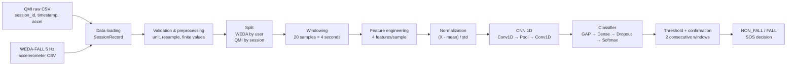
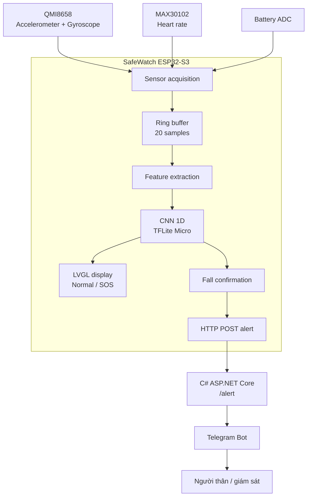

# SafeWatch: Đồng hồ thông minh phát hiện té ngã bằng Edge AI

SafeWatch là hệ thống đồng hồ thông minh phát hiện té ngã theo thời gian thực. Dữ liệu chuyển động được thu từ cảm biến IMU, xử lý trên ESP32-S3 và đưa qua mô hình CNN 1D đã huấn luyện. Khi phát hiện té ngã, thiết bị hiển thị cảnh báo SOS, cho phép người dùng hủy cảnh báo và có thể gửi sự kiện về backend.

> **Trạng thái hiện tại:** pipeline huấn luyện, đánh giá, export TFLite INT8 và sinh mã C/C++/Arduino đã chạy hoàn chỉnh. Kết quả trong báo cáo lấy từ run `outputs/training/20260917_145303_991486`.

## 1. Tên đề tài và mục tiêu

### 1.1. Tên đề tài

**Thiết kế đồng hồ thông minh phát hiện té ngã bằng mô hình học sâu chạy trực tiếp trên thiết bị Edge AI.**

### 1.2. Mục tiêu

- Phát hiện té ngã từ tín hiệu gia tốc trong thời gian gần thực.
- Thực hiện suy luận trên ESP32-S3, không phụ thuộc cloud để đưa ra quyết định ban đầu.
- Giảm kích thước mô hình để phù hợp bộ nhớ và năng lực tính toán của thiết bị nhúng.
- Gửi cảnh báo SOS sau khi xác nhận té ngã.
- Hạn chế cảnh báo nhầm bằng threshold và yêu cầu nhiều cửa sổ liên tiếp.

## 2. Vấn đề cần giải quyết

Té ngã thường xảy ra đột ngột và người dùng có thể không thể tự gọi trợ giúp. Hệ thống cần giải quyết đồng thời các vấn đề sau:

1. Tín hiệu cảm biến có nhiễu, sai khác tần số lấy mẫu và sai khác đơn vị.
2. Dữ liệu WEDA-FALL và QMI không hoàn toàn đồng nhất về domain cảm biến.
3. Dữ liệu FALL và NON_FALL bị mất cân bằng.
4. Model phải đủ nhỏ để chạy trên vi điều khiển.
5. False negative nguy hiểm hơn false positive trong cảnh báo an toàn.
6. Hệ thống phải tiếp tục hoạt động cục bộ khi mất mạng.

## 3. Giải pháp tổng thể

SafeWatch sử dụng hai nguồn dữ liệu:

- **WEDA-FALL:** dữ liệu công khai, dùng để học đặc trưng tổng quát.
- **QMI:** dữ liệu thu từ cảm biến QMI8658, dùng để thích nghi với cảm biến và người dùng thực tế.

```text
WEDA-FALL + QMI
      ↓
Load và kiểm tra session
      ↓
Đổi đơn vị, resample, kiểm tra finite values
      ↓
Chia tập theo user/session
      ↓
Cắt cửa sổ 4 giây ở 5 Hz
      ↓
Sinh 4 feature cho mỗi mẫu
      ↓
Chuẩn hóa mean/std
      ↓
CNN 1D classifier
      ↓
P(NON_FALL), P(FALL)
      ↓
Threshold + 2 cửa sổ liên tiếp
      ↓
Kết quả FALL/NON_FALL và cảnh báo SOS
```

## 4. Điểm đặc biệt của dự án

### 4.1. Edge AI

Quyết định phát hiện té ngã được thực hiện trên ESP32-S3. Backend chỉ đảm nhiệm nhận và chuyển tiếp cảnh báo, không nằm trên đường đi bắt buộc của suy luận.

### 4.2. Kết hợp dữ liệu công khai và dữ liệu cá nhân

Model học kiến thức tổng quát từ WEDA-FALL, sau đó fine-tune với QMI. QMI được augmentation và trộn thêm một phần WEDA replay để giảm catastrophic forgetting.

### 4.3. Tín hiệu đầu vào nhỏ gọn

Pipeline hiện dùng bốn đặc trưng gia tốc có ý nghĩa vật lý thay vì đưa toàn bộ raw sensor vào model. Cách này giúp model nhẹ và phù hợp triển khai nhúng.

### 4.4. Xác nhận nhiều cửa sổ

Một cửa sổ có xác suất FALL cao chưa lập tức kích hoạt cảnh báo cuối. Hệ thống yêu cầu hai cửa sổ liên tiếp để giảm cảnh báo nhầm do một peak ngắn.

### 4.5. Quy trình export hoàn chỉnh

Pipeline sinh TFLite INT8, mảng byte C/C++, cấu hình inference, wrapper TFLite Micro, sketch Arduino và package triển khai.

## 5. Kiến trúc hệ thống


### 5.1. Tổng quan luồng xử lý



### 5.2. Thiết bị và dịch vụ



## 6. Kiến trúc CNN 1D cuối cùng

Pipeline hiện tại **không sử dụng CNN-GRU, BiGRU hoặc nhánh MLP 21 đặc trưng**. Kiến trúc thực tế trong `src/models/model.py` là CNN 1D nhẹ, được chọn để phù hợp ESP32-S3.

### 6.1. Các thành phần chính

1. **Input Layer:** nhận tensor cửa sổ cảm biến.
2. **Conv1D Encoder:** học pattern cục bộ theo thời gian.
3. **MaxPooling1D:** giảm chiều thời gian.
4. **Global Average Pooling:** gom đặc trưng toàn cửa sổ.
5. **Dense + Dropout:** học biểu diễn và giảm overfitting.
6. **Classification Head:** phân loại `NON_FALL` hoặc `FALL`.


### 6.2. Input Layer và tiền xử lý

Mỗi mẫu đầu vào của model là:

$$
\mathbf{X} \in \mathbb{R}^{B \times 20 \times 4}
$$

Trong đó $B$ là batch size, 20 là số mẫu trong cửa sổ, 5 Hz là tần số sau resample và 4 là số feature tại mỗi timestamp. Vì $20 / 5 = 4$, mỗi cửa sổ tương ứng 4 giây.

QMI có ba trục gia tốc:

$$
\mathbf{a}_t = [a_{x,t}, a_{y,t}, a_{z,t}]
$$

QMI được đổi từ $m/s^2$ sang $g$ và resample từ khoảng 6.25 Hz xuống 5 Hz. WEDA được tự nhận diện đơn vị rồi đưa về cùng hệ $g$.

### 6.3. Feature Engineering

Với mỗi mẫu gia tốc, pipeline tạo bốn feature:

1. **Magnitude**

$$
m_t = \sqrt{a_{x,t}^2 + a_{y,t}^2 + a_{z,t}^2}
$$

2. **Độ lệch khỏi trọng lực**

$$
d_t = |m_t - 1|
$$

3. **Độ thay đổi magnitude**

$$
\Delta m_t = m_t - m_{t-1}
$$

4. **Góc thay đổi giữa hai vector gia tốc**

$$
	heta_t = \arccos\left(\frac{\mathbf{a}_{t-1} \cdot \mathbf{a}_t}{\|\mathbf{a}_{t-1}\|\|\mathbf{a}_t\|}\right)
$$

Feature tensor của một cửa sổ có dạng:

$$
\mathbf{X}_{feat} \in \mathbb{R}^{20 \times 4}
$$

### 6.4. Chuẩn hóa

Mean và standard deviation được tính từ dữ liệu train của hai domain, với trọng số cân bằng giữa WEDA và QMI:

$$
\mathbf{X}_{norm} = \frac{\mathbf{X}_{feat} - \boldsymbol{\mu}}{\boldsymbol{\sigma}}
$$

Trong đó $\boldsymbol{\mu} \in \mathbb{R}^{4}$ và $\boldsymbol{\sigma} \in \mathbb{R}^{4}$.

### 6.5. CNN Encoder

| Layer | Cấu hình | Output shape |
|---|---|---|
| Input | 20 samples × 4 features | `(B, 20, 4)` |
| Conv1D `conv1` | 16 filters, kernel 3, same, ReLU | `(B, 20, 16)` |
| MaxPooling1D `pool1` | pool size 2 | `(B, 10, 16)` |
| Conv1D `conv2` | 24 filters, kernel 3, same, ReLU | `(B, 10, 24)` |
| GlobalAveragePooling1D | trung bình theo thời gian | `(B, 24)` |
| Dense | 16 units, ReLU | `(B, 16)` |
| Dropout | rate 0.20 | `(B, 16)` |
| Dense classifier | 2 units, Softmax | `(B, 2)` |

Phép tích chập một chiều tổng quát:

$$
h_{t,c}^{(l)} = \operatorname{ReLU}\left(b_c^{(l)} + \sum_i\sum_k W_{c,i,k}^{(l)} h_{t+k,i}^{(l-1)}\right)
$$

### 6.6. Classification Head

Đầu ra Dense cuối cùng tạo hai logit $z_0, z_1$. Softmax chuyển chúng thành xác suất:

$$
P(y=i \mid \mathbf{X}) = \frac{e^{z_i}}{e^{z_0}+e^{z_1}}, \quad i \in \{0,1\}
$$

Quy ước lớp:

```text
index 0 -> NON_FALL
index 1 -> FALL
```

Xác suất té ngã là:

$$
p_{fall} = P(y=FALL \mid \mathbf{X}) = output[:,1]
$$

### 6.7. Quyết định cảnh báo

Thông số của run hiện tại:

```text
FALL_THRESHOLD       = 0.71
HIGH_FALL_THRESHOLD  = 0.86
CONSECUTIVE_REQUIRED = 2
```

```text
p_fall >= FALL_THRESHOLD
    ↓
Tăng bộ đếm cửa sổ té ngã
    ↓
Đủ 2 cửa sổ liên tiếp
    ↓
Xác nhận FALL và kích hoạt SOS
```

## 7. Quy trình huấn luyện và đánh giá

### 7.1. Chuẩn bị dữ liệu

| Dataset | CSV | Session hợp lệ | Ghi chú |
|---|---:|---:|---|
| WEDA-FALL 5 Hz | 969 | 962 | 612 NON_FALL, 350 FALL |
| QMI | 9 | 175 | 121 NON_FALL, 54 FALL |

### 7.2. Chia dữ liệu

- WEDA chia theo **user** để tránh rò rỉ giữa các session của cùng người.
- QMI chia theo **session**.
- WEDA: 644 train, 146 validation, 172 test session.
- QMI: 140 train, 35 validation session.

### 7.3. Fine-tuning

Tập fine-tune có kích thước `(2520, 20, 4)`, gồm QMI augmentation và WEDA replay. Class weight:

```text
NON_FALL: 0.7464
FALL:     1.5144
```

## 8. Kết quả thực nghiệm

### 8.1. Kết quả theo dataset

| Giai đoạn | Accuracy | Precision FALL | Recall FALL | F1 FALL |
|---|---:|---:|---:|---:|
| WEDA sau pretrain | 91.42% | 83.33% | 86.67% | 84.97% |
| WEDA sau fine-tune | 89.93% | 78.57% | 88.00% | 83.02% |
| QMI validation | 88.57% | 100.00% | 63.64% | 77.78% |
| TFLite INT8 trên QMI | 85.71% | 100.00% | 54.55% | 70.59% |

### 8.2. Diễn giải

Model học tốt trên WEDA, nhưng recall trên QMI còn thấp. Trong 11 session FALL của QMI validation, model float phát hiện đúng khoảng 7 session và bỏ sót khoảng 4 session. Sau chuyển sang INT8, recall giảm thêm.

Kết quả cho thấy domain gap giữa WEDA và QMI vẫn đáng kể. Model có precision cao nhưng chưa đủ nhạy cho bài toán an toàn, trong đó false negative cần được ưu tiên giảm.

### 8.3. Kiểm tra INT8

```text
Input shape:  [1, 20, 4]
Input dtype:  int8
Output shape: [1, 2]
Output dtype: int8
Keras ↔ INT8 agreement: 97.14%
```

## 9. Sản phẩm thử nghiệm

### 9.1. Màn hình hoạt động bình thường

Thiết bị hiển thị thời gian, pin, nhịp tim và trạng thái bình thường.


### 9.2. Màn hình cảnh báo SOS

Sau khi xác nhận té ngã, thiết bị hiển thị màn hình SOS màu đỏ và cho phép người dùng chạm để hủy cảnh báo nếu phát hiện nhầm.


## 10. Phần cứng và triển khai

| Thành phần | Linh kiện | Vai trò |
|---|---|---|
| MCU | ESP32-S3 | Thu thập tín hiệu và chạy inference |
| IMU | QMI8658 | Gia tốc và con quay hồi chuyển |
| Cảm biến nhịp tim | MAX30102 | Đo BPM |
| Màn hình | TFT 240×240, ST7789 | Hiển thị trạng thái và SOS |
| Giao diện | LVGL 8 | Giao diện đồng hồ |
| Kết nối | WiFi | Gửi cảnh báo |
| Nguồn | Li-Po 3.7 V | Cấp nguồn |

Các file firmware được sinh trong thư mục run:

```text
fall_model_data.h
fall_model_data.cc
fall_model_config.h
fall_model_config.json
fall_inference.h
fall_inference.cpp
SafeWatch_Fall_Detector.ino
```

## 11. Cấu trúc repository

```text
.
├── data/raw/
│   ├── QMI/
│   ├── WEDA-FALL/
│   └── merge/
├── notebooks/01_eda.ipynb
├── outputs/
│   ├── eda/
│   └── training/<run_id>/
├── src/
│   ├── config.yaml
│   ├── data/
│   ├── features/
│   ├── models/
│   ├── training/
│   ├── evaluation/
│   ├── export/
│   └── utils/
├── README.md
└── src/requirements.txt
```

## 12. Cài đặt và chạy

```bash
cd /home/vinh_shindo/safewatch-fall-detector-edge-ai
source /home/vinh_shindo/FuelSentinel-AI/.venv/bin/activate
pip install -r src/requirements.txt
```

Download và merge dữ liệu:

```bash
python3 src/data/download_merge.py
```

Nếu WEDA đã tải sẵn:

```bash
python3 src/data/download_merge.py --skip-download
```

Chạy EDA:

```bash
python3 src/data/eda.py
```

Chạy training:

```bash
cd src
PYTHONPATH=. python3 train.py
```

Mỗi lần chạy tạo một thư mục riêng tại `outputs/training/<run_id>/`. Có thể đặt tên run:

```bash
SAFEWATCH_RUN_ID=experiment_01 PYTHONPATH=. python3 train.py
```

## 13. Cấu hình

Các đường dẫn và tham số nằm trong [src/config.yaml](src/config.yaml), gồm dataset, sampling rate, windowing, augmentation, replay ratio, seed và cấu hình CPU/GPU.

Máy thử nghiệm có NVIDIA GeForce MX250 nhưng TensorFlow không nhận GPU do thiếu CUDA runtime tương thích trong WSL. Vì vậy cấu hình hiện tại dùng CPU:

```yaml
runtime:
  use_gpu: false
  intra_op_parallelism_threads: 2
  inter_op_parallelism_threads: 2
```

## 14. Hạn chế và hướng cải thiện

- QMI validation chỉ có 35 session, trong đó 11 session FALL.
- Recall FALL trên QMI còn thấp: 63.64% với Keras và 54.55% với INT8.
- Chưa có tập test QMI độc lập theo ngày mới.
- Chưa có module cleaning riêng cho timestamp gap và outlier vật lý.
- GPU chưa được sử dụng trong môi trường WSL.

Hướng cải thiện:

1. Bổ sung session FALL QMI ở nhiều hướng, tốc độ và điều kiện đeo.
2. Tạo tập QMI test độc lập từ ngày khác với train.
3. Chọn threshold trực tiếp trên output INT8.
4. Tối ưu threshold theo recall FALL vì false negative nguy hiểm hơn false positive.
5. Tăng WEDA replay hoặc giảm learning rate fine-tune để giảm catastrophic forgetting.
6. Đánh giá riêng theo `Fall_Back`, `Fall_Front`, `Fall_Left`, `Fall_Right`.
7. Thêm smoothing xác suất và đánh giá theo sự kiện thay vì chỉ theo window.

## 15. Kết luận

SafeWatch đã hình thành pipeline Edge AI hoàn chỉnh từ dữ liệu cảm biến đến sản phẩm thử nghiệm. Mô hình CNN 1D có kích thước nhỏ, input rõ ràng và đã được chuyển thành TFLite INT8 cùng mã triển khai ESP32.

Kết quả WEDA cho thấy mô hình phân biệt té ngã tốt ở domain công khai. Tuy nhiên, kết quả QMI cho thấy cần bổ sung dữ liệu cá nhân và hiệu chỉnh threshold để đạt độ nhạy phù hợp với ứng dụng an toàn trước khi đánh giá thực địa quy mô lớn.

## 16. License

Dự án phát hành theo giấy phép MIT. Xem [LICENSE](LICENSE).
